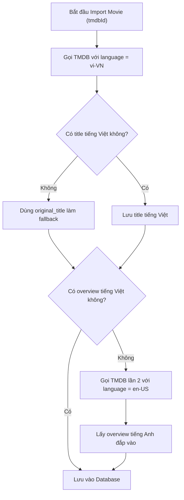

# CineBook — Báo cáo Kiểm toán Bản địa hóa Toàn diện (Localization Audit Report)

> **Chế độ thực thi:** AUDIT ONLY (Chỉ kiểm toán — Tuyệt đối không sửa code, không sửa database, không tạo migration, không đổi API contract, không thêm dependency).  
> **Thời điểm kiểm toán:** 2026-09-11  
> **Tài liệu căn cứ:** `AGENTS.md`, `docs/architecture/**`, `docs/business-rules/**`, `docs/api/**`, `docs/database.md`, mã nguồn Spring Boot Backend và Vue 3 Frontend.

---

## 1. Executive Summary

CineBook đã hoàn thành toàn bộ tính năng kỹ thuật từ Phase 0 đến Phase 4 (bao gồm Quản lý rạp/phòng/ghế, Đặt vé & Giữ chỗ 5 phút, Cổng thanh toán VNPay, F&B Concessions, In-App Notifications và Báo cáo doanh thu XLSX/CSV). Tuy nhiên, qua quá trình kiểm toán toàn diện hệ thống bản địa hóa (Localization Audit), phát hiện **4 nhóm vấn đề cốt lõi** đang làm giảm trải nghiệm người dùng và tính chuyên nghiệp của sản phẩm:

1. **Movie / TMDB Metadata bị cố định tiếng Anh (`en-US`)**:
   - Tham số cấu hình `tmdb.language` đang mặc định là `en-US`.
   - Tiêu đề (`title`) và phần tóm tắt nội dung (`overview`) của phim nhập từ TMDB hoàn toàn bằng tiếng Anh.
   - Khi Admin biên tập lại tiêu đề/nội dung tiếng Việt, thao tác re-sync từ TMDB sẽ **ghi đè và xóa sạch dữ liệu tiếng Việt của Admin**.
   - Nếu chỉ đổi đơn thuần sang `language=vi-VN`, hơn 70% phim trên TMDB không có `overview` tiếng Việt sẽ trả về chuỗi rỗng `""` và làm sập luồng import (`BadRequestException`).
2. **Thiếu vắng mã lỗi máy đọc được (Machine-Readable Error Code)**:
   - DTO `ErrorResponse` chỉ có `status`, `error`, `message`, `path`, `details`. Không có trường `code` (như `BOOKING_EXPIRED`, `SEAT_ALREADY_HELD`).
   - Frontend buộc phải hiển thị nguyên văn chuỗi string từ Backend hoặc bóc tách chuỗi thủ công.
3. **Pha trộn ngôn ngữ hỗn tạp giữa Backend và Frontend**:
   - Cùng một endpoint `POST /api/v1/bookings`, lỗi ghế trả tiếng Anh còn lỗi đồ ăn trả tiếng Việt.
   - Khi người dùng chọn giao diện tiếng Anh, các thông báo lỗi nghiệp vụ từ Backend vẫn bắn ra tiếng Việt; ngược lại khi chọn tiếng Việt, lỗi đăng nhập lại hiện tiếng Anh (`"Invalid email or password"`).
4. **Nguy cơ rò rỉ thông tin kỹ thuật (Information Disclosure)**:
   - Handler 500 trả về `"An unexpected error occurred: " + ex.getMessage()` làm lộ câu lệnh SQL, tên bảng, cú pháp Hibernate khi phát sinh lỗi hệ thống.
   - `TmdbAuthException` lộ tên biến môi trường `TMDB_API_KEY`.
   - Một số thông điệp còn sót từ khóa `"đồ án tốt nghiệp"`, `"HMAC-SHA512"`, `"IPN authoritative"`.

---

## 2. Current Localization Architecture

Hệ thống bản địa hóa hiện tại được phân bố như sau:

```text
┌─────────────────────────────────────────────────────────────────────────┐
│                              FRONTEND (Vue 3)                            │
│  - Composable useI18n: ref<Locale> ('vi' | 'en'), localStorage          │
│  - Từ điển: locales/vi.ts (1,062 dòng), locales/en.ts (1,053 dòng)      │
│  - Fallback: en -> vi -> raw key string                                 │
│  - Rào cản: FoodSelection, AdminPricing, AdminFoods chưa cắm useI18n    │
└────────────────────────────────────┬────────────────────────────────────┘
                                     │ HTTP (JSON REST API)
                                     ▼
┌─────────────────────────────────────────────────────────────────────────┐
│                        BACKEND API (Spring Boot 3)                      │
│  - Không hỗ trợ Accept-Language header                                  │
│  - ErrorResponse: Chỉ trả text message tự do (hỗn hợp EN / VI)          │
│  - NotificationService: Lưu chuỗi tiếng Việt hardcoded vào MySQL        │
│  - Validation: Bean Validation DTO phân mảnh (40% EN, 60% VI)           │
└────────────────────────────────────┬────────────────────────────────────┘
                                     │ HTTP RestClient
                                     ▼
┌─────────────────────────────────────────────────────────────────────────┐
│                           EXTERNAL TMDB API                             │
│  - tmdb.language = en-US (cố định trong application.yml)                │
│  - Map trực tiếp vào Movie.title và Movie.overview (tiếng Anh)          │
└─────────────────────────────────────────────────────────────────────────┘
```

---

## 3. Backend Error Audit

### 3.1. Phân tích DTO & Global Exception Handler
- **DTO `ErrorResponse.java`**:
  ```json
  {
    "timestamp": "2026-09-11T03:15:00",
    "status": 400,
    "error": "Bad Request",
    "message": "Danh sách ghế không được để trống.",
    "path": "/api/v1/bookings",
    "details": [{ "field": "seatIds", "message": "Seat IDs list cannot be empty" }]
  }
  ```
  *Điểm yếu:* Hoàn toàn thiếu trường `code` định danh mã lỗi chuẩn hóa.
- **Rủi ro rò rỉ kỹ thuật tại `GlobalExceptionHandler.java`**:
  - Dòng 166: `handleGenericException` ghép chuỗi `"An unexpected error occurred: " + ex.getMessage()`. Khi gặp lỗi database constraint hoặc driver crash, toàn bộ câu lệnh SQL và cấu trúc bảng nội bộ bị lộ ra client.
  - Thiếu `HttpMessageNotReadableException`: Khi client gửi JSON sai format hoặc Enum không hợp lệ, lỗi rơi vào `Exception.class` -> trả về **HTTP 500** kèm tên package Java nội bộ (`Cannot deserialize value of type com.cinebook.enums...`) thay vì **HTTP 400**.
  - `TmdbAuthException.java:12`: Message chứa chuỗi `"check TMDB_API_KEY configuration"`, trực tiếp để lộ tên biến môi trường bí mật.

### 3.2. Bảng kê phân loại thông điệp lỗi trong các Service

| Nhóm chức năng | File / Class | Ngôn ngữ hiện tại | Ví dụ thông điệp lỗi | FE hiển thị | Đề xuất phân tầng |
|---|---|:---:|---|---|---|
| **Xác thực (Auth)** | `AuthServiceImpl` | Hỗn hợp (60% EN / 40% VI) | `"Invalid email or password"`, `"Account is blocked or deactivated"`, `"Mã xác thực đã hết hạn"` | Toast / ErrorAlert | Backend trả ErrorCode (`AUTH_FAILED`, `ACCOUNT_BLOCKED`); FE map từ điển |
| **Người dùng (User)** | `UserServiceImpl` | 100% Tiếng Anh | `"User not found with id: ..."`, `"Cannot disable the last active administrator"` | Toast tiếng Anh | Chuẩn hóa mã lỗi; FE hiển thị tiếng Việt/Anh |
| **Phim (Movie)** | `MovieServiceImpl` | 100% Tiếng Anh | `"Movie not found with id: ..."`, `"Movie with TMDB ID ... already exists"` | Alert tiếng Anh | Chuẩn hóa mã lỗi |
| **Rạp (Cinema)** | `CinemaServiceImpl` | 100% Tiếng Anh | `"Cinema with name '...' in city '...' already exists"` | Toast tiếng Anh | Chuẩn hóa mã lỗi |
| **Phòng chiếu (Auditorium)** | `AuditoriumServiceImpl`| Hỗn hợp (70% EN / 30% VI) | `"Cannot delete auditorium with existing showtimes"`, `"Phòng chiếu đã ngừng hoạt động"` | Toast / Form error | Chuẩn hóa mã lỗi |
| **Suất chiếu (Showtime)** | `ShowtimeServiceImpl` | Hỗn hợp (40% EN / 60% VI) | `"Showtime not found"`, `"Giá vé cơ bản không được âm!"`, `"Không thể di chuyển suất chiếu đã có vé đặt!"` | Toast / Banner | Chuẩn hóa mã lỗi |
| **Đặt vé (Booking)** | `BookingServiceImpl` | 95% Tiếng Việt | `"Một hoặc nhiều ghế đã được giữ chỗ bởi người khác"`, `"Không thể đặt quá 8 ghế"`, `"Lịch chiếu đã kết thúc"` | Modal / Toast | Giữ thông điệp tiếng Việt làm fallback; bổ sung `code` cho FE map |
| **Thanh toán (Payment)** | `PaymentServiceImpl` | 90% Tiếng Việt | `"Chữ ký phản hồi không hợp lệ"`, `"Khách hàng đã hủy giao dịch trên cổng thanh toán"` | Màn hình kết quả | Giữ nguyên mapping VNPay tiếng Việt |
| **Hoàn tiền (Refund)** | `PaymentServiceImpl` | 95% Tiếng Việt | `"Khách hàng chỉ có thể yêu cầu hoàn tiền trước giờ chiếu ít nhất 2 tiếng"`, `"Không thể hoàn tiền cho đơn hàng đã được sử dụng để vào rạp"` | Toast / Modal | Giữ thông điệp nghiệp vụ tiếng Việt |
| **F&B (Bắp nước)** | `FoodItemServiceImpl`| 100% Tiếng Việt | `"Món ăn/thức uống với tên '...' đã tồn tại"`, `"Không tìm thấy món ăn..."` | Toast tiếng Việt | Chuẩn hóa mã lỗi |
| **Khuyến mãi (Promotion)**| `PromotionServiceImpl`| 100% Tiếng Việt | `"Ngày kết thúc phải sau ngày bắt đầu"`, `"Mã khuyến mãi đã hết lượt sử dụng"` | Form / Toast | Chuẩn hóa mã lỗi |

---

## 4. Frontend Error Audit

### 4.1. Lỗi hiển thị do cơ chế xử lý Axios
- Mẫu code phổ biến trên frontend:
  ```typescript
  const msg = err.response?.data?.message || t('common.errorTitle');
  toast.error(msg);
  ```
- **Hệ quả 1 (Đè bẹp bản dịch FE)**: Tại `LoginView.vue`, frontend đã chuẩn bị chuỗi tiếng Việt `"Đăng nhập thất bại. Vui lòng kiểm tra lại email hoặc mật khẩu."`. Nhưng do backend luôn trả `message: "Invalid email or password"`, toán tử `||` ưu tiên chuỗi backend, khiến người dùng Việt Nam luôn nhìn thấy câu tiếng Anh.
- **Hệ quả 2 (Lỗi đảo ngược tham số Toast)**:
  - Khai báo tại `toast.ts`: `error(message: string, title: string = 'Đã có lỗi xảy ra')`.
  - Tại `BookingView.vue`, `MyBookingsView.vue`, lập trình viên gọi: `toast.error(t('common.errorTitle'), msg)`.
  - Kết quả: Tiêu đề nhỏ chứa toàn bộ thông điệp lỗi dài, còn thân Toast lớn chỉ hiện chữ `"LỖI"`.

### 4.2. Khóa dịch bị thiếu & Các màn hình chưa cắm i18n
1. **Thiếu 9 khóa dịch trong `en.ts`**: Toàn bộ khối `adminShowtimes.calendar` (`dragHint`, `moveSuccess`, `moveFailed`, `bookedShowtimeWarning`, `quickMoveModalTitle`, `newAuditorium`, `newStartTime`, `saveMoveBtn`, `cancelBtn`).
2. **Các View Admin chưa tích hợp `useI18n` (0% i18n)**:
   - `AdminLayout.vue`: Toàn bộ thanh menu bên trái bằng tiếng Việt, không có nút chuyển ngôn ngữ.
   - `AdminPricingView.vue` (1084 dòng): Hardcode 100% tiếng Việt, bỏ phí block `adminPricing` trong từ điển.
   - `AdminFoodsView.vue` (547 dòng): Hardcode 100% tiếng Việt, bỏ phí block `adminFoods`.
   - `FoodSelection.vue` (Customer): Hardcode 100% tiếng Việt.

---

## 5. Notification Audit

### 5.1. Khảo sát CSDL & Logic phát sinh thông báo
- Bảng `notifications`:
  - `user_id`: VARCHAR(36) NOT NULL
  - `booking_id`: VARCHAR(36) NOT NULL (ràng buộc cứng, không thể tạo thông báo chung)
  - `type`: VARCHAR(50) NOT NULL (`PAYMENT_SUCCESS`, `BOOKING_CANCELLED`, `REFUND_COMPLETED`)
  - `title`: VARCHAR(255) NOT NULL
  - `message`: TEXT NOT NULL (lưu ý: tên cột trong CSDL là `message`, không phải `content`)
  - `uk_notifications_booking_type`: Unique constraint chống trùng lặp theo đơn và loại.

### 5.2. Đánh giá tính nhất quán đa ngôn ngữ & nghiệp vụ
- **Tính nhất quán nghiệp vụ (Business Semantic Alignment)**:
  - **Khách hủy thanh toán tại cổng VNPay (`code = 24`)**: Backend chỉ chuyển `Payment -> CANCELLED`, giữ nguyên `Booking -> PENDING_PAYMENT` và **KHÔNG PHÁT THÔNG BÁO `BOOKING_CANCELLED`**. Ghế vẫn được giữ trong 5 phút. Quy tắc này được thực hiện chính xác 100%.
- **Hạn chế bản địa hóa**:
  - `title` và `message` được hardcode bằng tiếng Việt tại `BookingServiceImpl.java` (L847, L981, L1070).
  - Khi người dùng đổi giao diện sang tiếng Anh, danh sách thông báo trên chuông vẫn hiển thị tiếng Việt vì dữ liệu lưu chết trong CSDL.

---

## 6. Movie / TMDB Data Flow

Toàn bộ vòng đời dữ liệu phim hiện tại:

```text
TMDB API (/movie/{id}?language=en-US)
      │
      ▼ (TmdbApiClient)
TmdbMovieDetailDto (title: "Interstellar", overview: "The adventures of...")
      │
      ▼ (TmdbImportServiceImpl.applyTmdbFields)
Movie Entity (title = "Interstellar", overview = "The adventures of...")
      │
      ▼ (MovieRepository.save)
MySQL Database (Bảng `movies`: cột `title` và `overview` lưu tiếng Anh)
      │
      ▼ (MovieServiceImpl -> MovieDetailResponse)
REST API (GET /api/v1/movies/{id} trả về JSON tiếng Anh)
      │
      ▼ (Axios)
Vue 3 Frontend (MovieCard.vue, MovieDetailView.vue render tiếng Anh)
```

---

## 7. TMDB Vietnamese Localization Analysis

### 7.1. Hiện trạng gọi TMDB API
- `TmdbProperties.java`: `language: String = "en-US"`.
- `TmdbApiClient.java`: Truyền query param `?language=en-US` vào `/genre/movie/list` và `/movie/{id}`.

### 7.2. Phân tích hành vi khi đổi sang `language=vi-VN`
1. **Thể loại phim (`/genre/movie/list?language=vi-VN`)**:
   - TMDB hỗ trợ tiếng Việt đầy đủ 100% cho 19 thể loại chuẩn (Action -> "Hành Động", Horror -> "Kinh Dị", Science Fiction -> "Phim Khoa Học Viễn Tưởng").
2. **Chi tiết phim (`/movie/{id}?language=vi-VN`)**:
   - **RỦI RO CHÍ MẠNG**: TMDB **không tự động fallback về tiếng Anh cho từng trường riêng lẻ** (No field-level cascade).
   - Với các phim bom tấn lớn, TMDB có thể có tiêu đề tiếng Việt nhưng **đa số phim không có `overview` tiếng Việt**. Khi đó, TMDB trả về `overview: ""` (chuỗi rỗng) hoặc `null`.
   - Trong `TmdbImportServiceImpl.java` dòng 129:
     ```java
     if (!StringUtils.hasText(detail.getOverview())) {
         throw new BadRequestException("TMDB movie (id=" + tmdbId + ") is missing required field: overview");
     }
     ```
   - **Hậu quả**: Nếu chỉ đổi cấu hình sang `vi-VN`, hơn 70% lượt import phim sẽ **ngay lập tức quăng lỗi `BadRequestException` và thất bại hoàn toàn**.

---

## 8. Fallback Strategy Analysis

Để giải quyết triệt để rủi ro trên, hệ thống cần áp dụng chiến lược **2-Step Smart Fetching Fallback** tại tầng Backend:



- **Title Fallback**: `title (vi-VN)` $\rightarrow$ nếu rỗng $\rightarrow$ `original_title` (tiếng Anh gốc).
- **Overview Fallback**: `overview (vi-VN)` $\rightarrow$ nếu rỗng $\rightarrow$ gọi lấy `overview (en-US)` $\rightarrow$ nếu vẫn rỗng $\rightarrow$ chuỗi mặc định: `"Nội dung phim đang được cập nhật."`. Tuyệt đối không quăng exception làm hỏng luồng import.
- **Frontend Dual-Title Support**: `MovieCard.vue` đã code sẵn logic hiển thị:
  - Dòng to: `movie.title` (tiếng Việt).
  - Dòng nhỏ in nghiêng: `movie.originalTitle` (tiếng Anh gốc, nếu khác tiêu đề chính).

---

## 9. Database Schema Impact

### Bảng phân tích tác động CSDL:

| Thay đổi đề xuất | Cần thiết? | Lý do kỹ thuật |
|---|:---:|---|
| **Thêm cột `title_vi` vào `movies`** | **KHÔNG** | Bảng `movies` đã có sẵn cặp cột: `title` (tiêu đề hiển thị chính) và `original_title` (tiêu đề gốc/tiếng Anh). Chỉ cần lưu tên tiếng Việt vào `title` và tên tiếng Anh vào `original_title`. |
| **Thêm cột `overview_vi` vào `movies`** | **Tùy chọn** | Nếu muốn hỗ trợ chuyển đổi EN/VI tức thời cho overview thì thêm `overview_vi TEXT NULL`. Nếu chỉ cần hiển thị tiếng Việt ưu tiên thì lưu thẳng vào `overview`. |
| **Mở rộng độ dài cột `overview`** | **NÊN** | Entity đang để `VARCHAR(2000)`. Tóm tắt tiếng Việt có dấu thường dài hơn tiếng Anh, nên chuyển sang `TEXT` để tránh `DataTruncationException`. |
| **Thêm cờ `is_curated` / `manual_override`** | **KHUYẾN NGHỊ** | Thêm cột `is_manual_override BOOLEAN DEFAULT FALSE` để đánh dấu phim đã được Admin biên tập, ngăn TMDB re-sync ghi đè mất tiếng Việt. |
| **Bảng `notifications`** | **GIỮ NGUYÊN** | Bảng đã ổn định với 3 sự kiện thanh toán/hủy/hoàn tiền. Không cần migration. |

---

## 10. API Contract Impact

Đề xuất chuẩn hóa hợp đồng lỗi JSON (Error Contract) mà không phá vỡ tương thích ngược:

```json
{
  "timestamp": "2026-09-11T03:15:00",
  "status": 400,
  "error": "Bad Request",
  "code": "SHOWTIME_TOO_CLOSE",
  "message": "Khách hàng chỉ có thể yêu cầu hoàn tiền trước giờ chiếu ít nhất 2 tiếng.",
  "path": "/api/v1/payments/refund",
  "details": null
}
```

- **Quy tắc**:
  - Thêm trường `"code": String` (Machine-readable error code).
  - Giữ nguyên trường `"message"` tiếng Việt thân thiện làm mặc định.
  - Frontend nếu phát hiện có `code` và đang ở ngôn ngữ `en`, sẽ tra cứu `t('errors.' + code)`. Nếu không có, fallback hiển thị `message`.

---

## 11. Frontend Impact

1. **Bổ sung 9 translation keys bị thiếu trong `en.ts`**.
2. **Chuẩn hóa chữ ký `toast.error(message, title)`**: Sửa các chỗ gọi bị ngược tham số tại `BookingView.vue` và `MyBookingsView.vue`.
3. **Cắm `useI18n` vào `AdminLayout.vue`, `AdminPricingView.vue`, `AdminFoodsView.vue`, `FoodSelection.vue`**.
4. **Sửa lỗi hiển thị `formatStatus()`**: Truyền `locale` hiện tại thay vì bỏ trống khiến hàm luôn format tiếng Việt.
5. **Sửa các điểm hiển thị raw enum code**: Thêm mapper cho `PENDING_PAYMENT`, `ENDED`, `FIXED_AMOUNT`.

---

## 12. Security / Information Disclosure

Đánh giá và loại bỏ các điểm rò rỉ kỹ thuật:

| Vị trí | Dữ liệu bị rò rỉ | Giải pháp khắc phục |
|---|---|---|
| `GlobalExceptionHandler:166` | Lộ câu lệnh SQL, tên bảng, Hibernate stack trace qua `ex.getMessage()` | Thay bằng: `"Đã xảy ra lỗi không mong muốn trên hệ thống. Vui lòng thử lại sau."` |
| `TmdbAuthException:12` | Lộ tên biến môi trường `TMDB_API_KEY` | Bỏ tên biến môi trường, chỉ ghi log server và trả về message chung |
| `PaymentServiceImpl:663` | Lộ raw payload và response code nội bộ của VNPay Sandbox | Chuẩn hóa thông báo từ chối hoàn tiền thân thiện với người dùng |
| `locales/vi.ts:294-295` | Chứa từ khóa `"đồ án tốt nghiệp"`, `"HMAC-SHA512"`, `"IPN authoritative"` | Sửa thành ngôn ngữ thương mại: `"Giao diện thanh toán thử nghiệm..."` |
| `locales/vi.ts:796` | Chứa từ khóa `"(Booking UUID)"` | Sửa thành: `"Mã định danh đơn đặt vé"` |

---

## 13. Options Comparison (TMDB Localization)

| Tiêu chí | Option 1: TMDB `vi-VN` Đơn thuần | Option 2: Smart Fetch Fallback (vi-VN + en-US) | Option 3: Third-Party Translation API | Option 4: Admin Manual Curated |
|---|:---:|:---:|:---:|:---:|
| **Tính ổn định (Không lỗi import)** | 3/10 (Crash khi thiếu overview) | **9.5/10 (Tự động bù đắp)** | 6/10 (Phụ thuộc API ngoài) | **9/10 (Ổn định tuyệt đối)** |
| **Chi phí / Quota** | Miễn phí | **Miễn phí (TMDB)** | Tốn phí / Giới hạn RPM | **Miễn phí** |
| **Độ trễ khi Import** | ~200ms | ~400ms (nếu gọi lần 2) | ~3000ms (chờ AI dịch) | Tức thì |
| **Chất lượng tên phim** | Chuẩn tên phát hành rạp VN | **Chuẩn tên phát hành rạp VN** | Dễ sai lệch dịch thô | **Rất cao (Admin nhập)** |
| **Bảo vệ dữ liệu biên tập** | Không (Bị ghi đè) | **Có (Bảo vệ dữ liệu)** | Không | **Có** |
| **Độ phù hợp đồ án tốt nghiệp** | Kém | **XUẤT SẮC NHẤT** | Over-engineering | Rất tốt |

---

## 14. Recommended Architecture

**Kiến trúc khuyến nghị: HYBRID (Kết hợp Option 2 Smart Fallback + Option 4 Curated Protection)**:

1. **Tầng TMDB Service**:
   - Chuyển `tmdb.language = vi-VN`.
   - Khi import phim: Gọi `vi-VN` trước. Nếu `overview` rỗng, tự động gọi fallback `en-US` để bù nội dung.
   - Thêm cờ bảo vệ: Khi re-import phim đã có trong CSDL, chỉ cập nhật trailer, poster, backdrop, thời lượng, thể loại; **giữ nguyên tiêu đề và nội dung tóm tắt nếu Admin đã biên tập thủ công**.
2. **Tầng Thể loại (Genres)**:
   - Chạy `POST /api/v1/admin/tmdb/genres/sync` với `language=vi-VN` để cập nhật tên 19 thể loại sang tiếng Việt chuẩn ("Hành động", "Kinh dị", "Khoa học viễn tưởng"...).
3. **Tầng Tên phim (Dual Title Strategy)**:
   - Lưu tên tiếng Việt vào `Movie.title` (hiển thị to, nổi bật).
   - Lưu tên tiếng Anh gốc vào `Movie.originalTitle` (hiển thị nhỏ, in nghiêng).
   - Tận dụng `MovieSpecification` đã hỗ trợ tìm kiếm đồng thời cả 2 tên.
4. **Tầng Mã lỗi**:
   - Thêm trường `code` vào `ErrorResponse` để chuẩn bị cho việc ánh xạ đa ngôn ngữ mượt mà.

---

## 15. Proposed Migration

| Hạng mục thay đổi | Cần Migration CSDL? | Chi tiết |
|---|:---:|---|
| **Đổi ngôn ngữ TMDB sang `vi-VN`** | **KHÔNG** | Chỉ thay đổi file cấu hình `application.yml` / `TmdbProperties.java`. |
| **Fallback luồng TMDB** | **KHÔNG** | Hoàn toàn nằm ở logic Java trong `TmdbImportServiceImpl.java`. |
| **Đồng bộ thể loại tiếng Việt** | **KHÔNG** | Dùng API sync genre hiện có cập nhật trực tiếp vào cột `name` của bảng `genres`. |
| **Bảo vệ nội dung Admin biên tập** | **Tùy chọn** | Có thể bổ sung cột `is_manual_override BOOLEAN DEFAULT FALSE` (Additive non-destructive). |
| **Mở rộng cột `overview`** | **KHUYẾN NGHỊ** | `ALTER TABLE movies MODIFY COLUMN overview TEXT NOT NULL;` (An toàn, không mất dữ liệu). |

---

## 16. Proposed Implementation Plan

### Step 1 — Backend Error Hardening & Sanitization
- `GlobalExceptionHandler.java`:
  - Ẩn `ex.getMessage()` trong lỗi 500, trả về thông điệp chuẩn an toàn.
  - Thêm handler cho `HttpMessageNotReadableException` để trả 400 thay vì 500.
  - Bổ sung trường `code` vào `ErrorResponse.java`.
- `TmdbAuthException.java`: Loại bỏ tên biến môi trường `TMDB_API_KEY`.

### Step 2 — TMDB Smart Fetching & Fallback
- `TmdbProperties.java`: Đổi default language sang `"vi-VN"`.
- `TmdbImportServiceImpl.java`:
  - Triển khai logic gọi TMDB `vi-VN` kèm fallback `en-US` khi `overview` bị rỗng.
  - Bảo vệ `title` và `overview` của Admin khi re-sync.
  - Chạy sync genres để cập nhật thể loại tiếng Việt.

### Step 3 — Frontend Polish & i18n Cohesion
- `en.ts`: Bổ sung 9 khóa dịch còn thiếu.
- `toast.ts` & Views: Sửa lỗi đảo ngược tham số `toast.error(message, title)`.
- `AdminTicketsView.vue`: Chuyển nhãn badge trạng thái soát vé sang dùng i18n.
- `locales/vi.ts` & `en.ts`: Loại bỏ các từ khóa `"đồ án tốt nghiệp"`, `"HMAC-SHA512"`, `"UUID"`.

---

## 17. Testing Plan

1. **Kiểm thử TMDB Fallback**:
   - Test case 1: Import phim có đầy đủ tiếng Việt trên TMDB (kiểm tra title/overview tiếng Việt).
   - Test case 2: Import phim không có overview tiếng Việt trên TMDB (kiểm tra fallback sang tiếng Anh thành công, không quăng exception 400).
   - Test case 3: Admin sửa title tiếng Việt -> Chạy Re-import TMDB -> Xác nhận title tiếng Việt của Admin không bị ghi đè.
2. **Kiểm thử Security & Error Sanitization**:
   - Gửi payload JSON sai cú pháp tới API -> Xác nhận trả về 400 Bad Request, không lộ package Java.
   - Giả lập lỗi DB nội bộ -> Xác nhận trả về 500 với thông điệp thân thiện, không lộ câu lệnh SQL.
3. **Kiểm thử Frontend i18n**:
   - Chuyển đổi qua lại giữa `VI` và `EN` trên tất cả các trang -> Xác nhận không có lỗi vỡ layout, không thiếu key.
   - Kiểm tra Toast hiển thị đúng thứ tự tiêu đề và nội dung.

---

## 18. Documentation Impact

- Cập nhật `docs/tmdb-import.md`: Bổ sung quy trình Smart Fallback và chính sách bảo vệ dữ liệu biên tập.
- Cập nhật `docs/business-rules.md`: Ghi nhận chuẩn hóa thuật ngữ Domain Glossary.
- Cập nhật `docs/api.md`: Bổ sung trường `code` trong lược đồ phản hồi lỗi `ErrorResponse`.

---

## 19. Risks / Open Questions

1. **Rủi ro giới hạn tốc độ TMDB (Rate Limit)**: Khi kích hoạt fallback 2-step (gọi `vi-VN` rồi gọi `en-US`), số lượng request tới TMDB sẽ tăng gấp đôi cho những phim thiếu tiếng Việt. Tuy nhiên, luồng import chạy theo yêu cầu của Admin với tần suất thấp nên rủi ro bị rate limit là rất nhỏ.
2. **Câu hỏi mở**: Có nên hiển thị song song cả 2 bản tóm tắt nội dung (tiếng Việt và tiếng Anh) trên trang chi tiết phim hay chỉ hiển thị một bản duy nhất tùy theo ngôn ngữ đang chọn của khách hàng? *(Đề xuất: Hiển thị 1 bản tóm tắt ưu tiên tiếng Việt, có nút toggle xem bản tiếng Anh gốc nếu muốn).*

---

## 20. Final Audit Conclusion

Cuộc kiểm toán đã hoàn thành mục tiêu toàn diện, vạch rõ nguyên nhân gốc rễ của các vấn đề bản địa hóa trên cả 3 tầng (Database, Backend, Frontend) mà **không làm thay đổi bất kỳ dòng code hay cấu trúc CSDL nào**.

Hệ thống CineBook hoàn toàn có thể đạt độ hoàn thiện cao nhất và tính chuyên nghiệp thương mại vượt bậc khi áp dụng phương án **HYBRID (Smart TMDB Fallback + Admin Curated Protection + Error Code Standardization)** trong pha triển khai tiếp theo.

