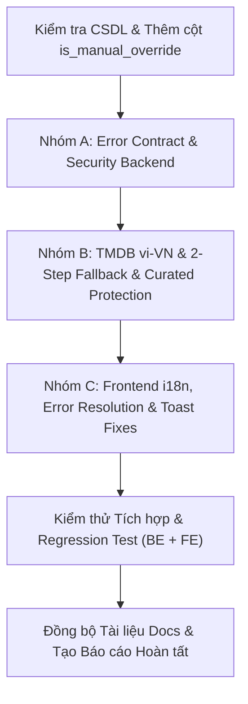

# CineBook — Kế hoạch Triển khai Bản địa hóa Toàn diện (Localization Implementation Plan)

> **Tài liệu căn cứ:** `AGENTS.md`, `docs/implementation-reports/localization-audit.md`, `docs/architecture/**`, `docs/business-rules.md`, `docs/api.md`, `docs/database.md`.  
> **Trạng thái:** Kế hoạch phục hồi (Restored Implementation Plan).  
> **Lưu ý an toàn:** Tuyệt đối không ghi đè `implementation_plan.md` (đang lưu kế hoạch Statistics đã duyệt); không làm ảnh hưởng đến các tính năng đã hoàn thiện (F&B UTF-8, Occupancy rate capacity-weighted, Admin user privacy, Promotion selection).

---

## 1. Bối cảnh & Mục tiêu

Sau khi hoàn thành kiểm toán tại `docs/implementation-reports/localization-audit.md`, hệ thống CineBook cần được triển khai giải pháp bản địa hóa theo mô hình **HYBRID (Smart TMDB Fallback + Admin Curated Protection + Machine-Readable Error Contract)** nhằm đạt các mục tiêu:

1. **Chuẩn hóa Error Contract**: Thêm trường `code` máy đọc được vào `ErrorResponse` của Backend, giúp Frontend chủ động tra cứu đa ngôn ngữ thay vì hiển thị nguyên văn chuỗi lỗi hoặc bóc tách chuỗi thủ công.
2. **Loại bỏ Information Disclosure**:
   - Ẩn toàn bộ `ex.getMessage()` trong lỗi 500 (chống lộ SQL query, tên bảng, Hibernate internals).
   - Thêm handler cho `HttpMessageNotReadableException` để trả HTTP 400 thay vì HTTP 500 kèm tên package Java.
   - Loại bỏ rò rỉ tên biến môi trường `TMDB_API_KEY` trong `TmdbAuthException`.
3. **Việt hóa Movie Metadata từ TMDB bền vững**:
   - Cấu hình mặc định TMDB sang `vi-VN`.
   - Cơ chế **2-Step Smart Fetching Fallback**:
     - Bước 1: Gọi TMDB với `language=vi-VN`.
     - Title Fallback: Nếu `vi-VN title` có $\rightarrow$ dùng tên Việt; nếu rỗng $\rightarrow$ fallback về `original_title`.
     - Overview Fallback: Nếu `vi-VN overview` có $\rightarrow$ dùng tóm tắt tiếng Việt; nếu rỗng/trắng $\rightarrow$ gọi tiếp bước 2 với `language=en-US`. Nếu bản tiếng Anh có $\rightarrow$ dùng tiếng Anh; nếu vẫn rỗng $\rightarrow$ để chuỗi rỗng `""` an toàn (không quăng `BadRequestException` làm sập import và không chèn text giả vào CSDL).
4. **Bảo vệ nội dung do Admin biên tập (Curated Content Protection)**:
   - Thêm cột `is_manual_override` vào bảng `movies` (non-destructive).
   - Khi Admin chỉnh sửa phim bằng tay qua giao diện Admin, đánh dấu `is_manual_override = true`.
   - Khi re-sync phim từ TMDB, nếu `is_manual_override == true` $\rightarrow$ bảo lưu nguyên vẹn `title` và `overview` của Admin; chỉ đồng bộ các trường kỹ thuật/media (poster, backdrop, trailer, runtime, director, actors, genres).
5. **Đồng bộ Thể loại (Genre) TMDB tiếng Việt**:
   - Đồng bộ 19 thể loại chuẩn TMDB sang tiếng Việt vào bảng `genres` qua endpoint sync genre hiện có.
6. **Chuẩn hóa Thông báo & Frontend i18n**:
   - Không can thiệp sửa đổi cấu trúc bảng `notifications` hay ghi đè dữ liệu cũ trong CSDL.
   - Frontend `NotificationBell.vue` chuyển ngữ tiêu đề/nội dung hiển thị linh hoạt theo `type` và `locale` hiện tại.
   - Bổ sung 9 keys bị thiếu trong `frontend/src/locales/en.ts` (`adminShowtimes.calendar.*`).
   - Sửa lỗi gọi ngược tham số `toast.error(message, title)` tại các View khách hàng.
   - Cắm `useI18n` vào các View Admin còn thiếu (`AdminLayout.vue`, `AdminPricingView.vue`, `AdminFoodsView.vue`, `FoodSelection.vue`).
   - Sửa hàm `formatStatus()` để tự động nhận biết ngôn ngữ hiện tại thay vì mặc định tiếng Việt.
   - Chuyển đổi các nhãn trạng thái và enum còn hiển thị thô sang dùng i18n (`AdminTicketsView.vue`).

---

## 2. Đối chiếu Hiện trạng Codebase (Status Assessment)

### 2.1. Đã triển khai (Already Implemented)
- [x] **Polish trang tĩnh công khai**: `AboutUsView.vue`, `TermsOfUseView.vue`, `PrivacyPolicyView.vue`, `RefundPolicyView.vue`, `FaqView.vue` đã được loại bỏ thuật ngữ kỹ thuật thừa (`JWT`, `Spring Boot`, `MySQL`, `HMAC-SHA512`, `IPN authoritative`, `UUID`, `đồ án tốt nghiệp`) và không chứa chứng chỉ giả định (`GDPR`, `PCI DSS`, `ISO`).
- [x] **Hiển thị song ngữ tên phim trên UI**: `MovieCard.vue` và `MovieDetailView.vue` đã hiển thị tiêu đề chính `movie.title` to nổi bật và `movie.originalTitle` in nghiêng.
- [x] **Kiểu dữ liệu cột trong MySQL**: Cột `overview` và `actors` trong bảng `movies` thực tế đã là kiểu `TEXT` (an toàn, không lo `DataTruncationException`).
- [x] **Client TMDB hỗ trợ tham số language**: Interface `TmdbClient.getMovieDetail(Long tmdbId, String language)` đã nhận `language: String`.
- [x] **Từ điển cơ sở**: Đã có `frontend/src/locales/vi.ts` (1,084 dòng) và `frontend/src/locales/en.ts` (1,075 dòng).
- [x] **Bảo toàn ngữ nghĩa hủy VNPay**: Khách hủy thanh toán tại VNPay Sandbox chỉ chuyển `Payment` sang `CANCELLED`, giữ nguyên `Booking` là `PENDING_PAYMENT` và không phát thông báo `BOOKING_CANCELLED`.

### 2.2. Triển khai một phần (Partially Implemented)
- [~] **TMDB Import**: Đã có `TmdbImportServiceImpl` nhưng đang cố định cấu hình `en-US`, quăng exception 400 nếu thiếu `overview`, chưa có 2-step fallback và chưa có cờ bảo vệ dữ liệu Admin biên tập.
- [~] **Formatters đa ngôn ngữ**: `frontend/src/utils/formatters.ts` đã có bản đồ EN/VI trong `formatStatus`, nhưng tham số mặc định là `'vi'`, khiến các màn hình không truyền locale bị hiển thị tiếng Việt trên giao diện tiếng Anh.
- [~] **Notification Presentation**: `NotificationBell.vue` đã i18n hóa thời gian tương đối (`timeJustNow`, `timeMinutesAgo`...), nhưng tiêu đề và nội dung vẫn bind trực tiếp từ trường lưu chết trong database.
- [~] **Admin Tickets View**: `AdminTicketsView.vue` đã dùng i18n cho header, nhưng badge trạng thái vé ('Chưa soát', 'Đã soát vé', 'Đã hủy') và một số thông báo toast đang hardcode tiếng Việt.

### 2.3. Chưa triển khai (Not Implemented)
- [ ] **Mã lỗi máy đọc được (Machine-Readable Error Code)**:
  - Backend thiếu enum/danh mục `ErrorCode`.
  - `ErrorResponse` thiếu trường `code`.
  - `AppException` và các lớp con (`BadRequestException`, `ConflictException`, `ResourceNotFoundException`...) chưa nhận `code`.
- [ ] **Bảo mật & Chuẩn hóa Handler (`GlobalExceptionHandler.java`)**:
  - Dòng 166: Lỗi 500 đang trả `An unexpected error occurred: + ex.getMessage()`.
  - Chưa có handler cho `HttpMessageNotReadableException` (vẫn văng 500 khi client gửi JSON sai enum/format).
  - `TmdbAuthException` vẫn còn chuỗi `"check TMDB_API_KEY configuration"`.
- [ ] **Cấu hình TMDB `vi-VN`**:
  - `application.yml` và `TmdbProperties.java` vẫn mặc định `language: en-US`.
- [ ] **Logic 2-Step Fallback & Curated Override**:
  - `Movie.java` chưa có trường `isManualOverride`.
  - `movies` table chưa có cột `is_manual_override`.
  - `TmdbImportServiceImpl.java` chưa xử lý fallback sang tiếng Anh và chưa bảo vệ `title`/`overview` khi re-sync.
- [ ] **Frontend Error Lookup Flow**:
  - `ApiError` interface trên FE chưa có `code`.
  - Chưa có hàm trợ giúp dịch lỗi tập trung theo `code` (với fallback an toàn về `message`).
  - Chưa bổ sung nhóm `errors.*` vào `vi.ts` và `en.ts`.
- [ ] **Frontend Audit Fixes**:
  - Thiếu 9 keys trong khối `adminShowtimes.calendar` của `en.ts`.
  - Đảo ngược tham số `toast.error(message, title)` tại `BookingView.vue`, `MyBookingsView.vue`, `DemoPaymentView.vue`.
  - Thiếu `useI18n` tại `AdminLayout.vue`, `AdminPricingView.vue`, `AdminFoodsView.vue`, `FoodSelection.vue`.

---

## 3. Đánh giá Xung đột với Task Thống kê / Báo cáo (Conflict Assessment)

Task trước đó đã hoàn thành 4 hạng mục:
1. **F&B UTF-8 Encoding**: Đã sửa triệt để các chuỗi mojibake trong bảng `food_items`.
2. **Occupancy Rate**: Đã sửa công thức bình quân gia quyền theo sức chứa (`capacity-weighted`) và chặn biên [0%, 100%] trong `ReportServiceImpl.java`.
3. **Date Filters**: Bổ sung bộ lọc preset và kiểm tra ngày hợp lệ trong `AdminReportController.java` và `AdminReportsView.vue`.
4. **Admin User Privacy**: Loại bỏ quyền sửa SĐT/email/mật khẩu trong `UserServiceImpl.java`, `AdminUpdateUserRequest.java`, `AdminUsersView.vue`.
5. **Promotion Available Endpoint**: Bổ sung `/api/v1/promotions/available` và giao diện chọn ưu đãi tại `BookingSummary.vue`.

**KẾT LUẬN XUNG ĐỘT: ZERO CONFLICT**.
- Các thay đổi của Localization không chạm vào logic tính toán doanh thu/công suất hay quyền riêng tư User.
- Dữ liệu `food_items` đã chuẩn Unicode không bị ảnh hưởng.
- Không ghi đè hay thay đổi các endpoint hay logic đã xây dựng ở task Thống kê.

---

## 4. Chi tiết Thiết kế Kỹ thuật (Technical Design)

### 4.1. Nhóm A — Chuẩn hóa Error Contract & Bảo mật Backend

#### A.1. Tạo Danh mục `ErrorCode` (`com.cinebook.exception.ErrorCode`)
Enum định danh các mã lỗi nghiệp vụ chuẩn hóa:
```java
public enum ErrorCode {
    // Auth & User
    AUTH_FAILED,
    INVALID_CREDENTIALS,
    ACCOUNT_BLOCKED,
    UNAUTHORIZED,
    FORBIDDEN,
    TOKEN_EXPIRED,
    USER_NOT_FOUND,
    USER_ALREADY_EXISTS,
    CANNOT_MODIFY_PROTECTED_USER,

    // Booking & Seat
    SEAT_ALREADY_HELD,
    SEAT_NOT_AVAILABLE,
    BOOKING_NOT_FOUND,
    BOOKING_EXPIRED,
    BOOKING_ALREADY_PAID,
    BOOKING_ALREADY_CANCELLED,
    MAX_SEATS_EXCEEDED,
    SHOWTIME_ENDED,
    HOLD_EXPIRED,

    // Payment & Refund
    PAYMENT_FAILED,
    PAYMENT_INVALID_SIGNATURE,
    REFUND_NOT_ELIGIBLE,
    SHOWTIME_TOO_CLOSE,
    TICKET_ALREADY_REDEEMED,

    // Resource & Generic
    RESOURCE_NOT_FOUND,
    BAD_REQUEST,
    VALIDATION_FAILED,
    CONFLICT,
    INTERNAL_SERVER_ERROR,
    TMDB_SERVICE_UNAVAILABLE,
    TMDB_RESOURCE_NOT_FOUND
}
```

#### A.2. Cập nhật `ErrorResponse.java`
Thêm trường `code`:
```java
@Getter
@Setter
@Builder
@NoArgsConstructor
@AllArgsConstructor
@JsonInclude(JsonInclude.Include.NON_NULL)
public class ErrorResponse {
    private LocalDateTime timestamp;
    private int status;
    private String error;
    private String code;       // Machine-readable code (e.g. SEAT_ALREADY_HELD)
    private String message;    // Safe, human-readable default message
    private String path;
    private List<FieldErrorDetail> details;
    ...
}
```

#### A.3. Cập nhật `AppException.java` và các lớp Exception con
Bổ sung trường `code` (dạng `String` hoặc `ErrorCode`) với constructor nạp chồng để duy trì 100% khả năng tương thích ngược.

#### A.4. Cập nhật `GlobalExceptionHandler.java`
1. **Lỗi 500 (`handleGenericException`)**:
   - Ghi log chi tiết ra server console: `log.error("Internal server error: ", ex);`
   - Trả về client thông điệp an toàn, không chứa `ex.getMessage()`:
     - `code`: `"INTERNAL_SERVER_ERROR"`
     - `message`: `"Đã xảy ra lỗi không mong muốn trên hệ thống. Vui lòng thử lại sau."`
2. **Thêm handler `HttpMessageNotReadableException`**:
   - Trả về HTTP 400 Bad Request:
     - `code`: `"BAD_REQUEST"`
     - `message`: `"Dữ liệu yêu cầu không hợp lệ hoặc sai định dạng."`
3. **Cập nhật `handleValidationException`**:
   - `code`: `"VALIDATION_FAILED"`
   - `message`: `"Dữ liệu đầu vào không hợp lệ."`
4. **Cập nhật `handleBadCredentialsException` & `AccessDeniedException`**:
   - Cung cấp mã `AUTH_FAILED` và `FORBIDDEN`.
5. **Cập nhật `handleAppException`**:
   - Gán `code` từ `ex.getCode()` (nếu có); nếu không có, fallback về `status.name()`.

#### A.5. Sửa `TmdbAuthException.java`
- Bỏ chuỗi `"check TMDB_API_KEY configuration"`.
- Trả về thông điệp thân thiện: `"TMDB service authentication failed. Please contact administrator."`

---

### 4.2. Nhóm B — Việt hóa Dữ liệu Phim TMDB & Smart Fallback

#### B.1. Cấu hình TMDB
- Trong `src/main/resources/application.yml`:
  ```yaml
  tmdb:
    language: ${TMDB_LANGUAGE:vi-VN}
  ```
- Trong `src/main/java/com/cinebook/config/TmdbProperties.java`:
  ```java
  private String language = "vi-VN";
  ```

#### B.2. Bổ sung cờ `isManualOverride` trong CSDL & Entity `Movie`
- **Database (Additive non-destructive)**:
  ```sql
  ALTER TABLE movies ADD COLUMN is_manual_override BOOLEAN NOT NULL DEFAULT FALSE;
  ```
- **Entity `Movie.java`**:
  ```java
  @Column(name = "is_manual_override", nullable = false)
  private Boolean isManualOverride = false;
  ```
- **Service `MovieServiceImpl.java`**:
  - Khi Admin gọi `updateMovie(String id, UpdateMovieRequest request)`, đánh dấu `movie.setIsManualOverride(true);`.

#### B.3. Triển khai 2-Step Fallback trong `TmdbImportServiceImpl.java`
Khi import hoặc re-sync phim theo `tmdbId`:
1. **Bước 1 (Primary request)**: Gọi `tmdbClient.getMovieDetail(tmdbId, "vi-VN")`.
2. **Xử lý Title Fallback**:
   - Nếu `detail.getTitle()` có nội dung $\rightarrow$ dùng làm `title`.
   - Nếu `detail.getTitle()` rỗng $\rightarrow$ fallback dùng `detail.getOriginalTitle()`.
   - Nếu cả 2 đều rỗng $\rightarrow$ mới báo `BadRequestException`.
3. **Xử lý Overview Fallback**:
   - Nếu `detail.getOverview()` có nội dung $\rightarrow$ dùng làm `overview`.
   - Nếu `detail.getOverview()` rỗng $\rightarrow$ gọi bước 2: `tmdbClient.getMovieDetail(tmdbId, "en-US")`.
     - Nếu bản tiếng Anh có overview $\rightarrow$ dùng `enDetail.getOverview()`.
     - Nếu vẫn rỗng $\rightarrow$ giữ chuỗi rỗng `""` an toàn (không quăng exception làm dừng luồng import; không ghi chuỗi giả vào CSDL).
4. **Bảo vệ dữ liệu Admin biên tập (`updateMovieFromTmdb`)**:
   - Nếu `Boolean.TRUE.equals(movie.getIsManualOverride())`:
     - **KHÔNG ghi đè** `movie.setTitle(...)` và `movie.setOverview(...)`.
     - Chỉ cập nhật các trường kỹ thuật/media: `originalTitle`, `durationMinutes`, `director`, `actors`, `country`, `language`, `releaseDate`, `posterUrl`, `backdropUrl`, `trailerUrl`, `ageRating`, và đồng bộ thể loại `syncMovieGenres`.
   - Nếu `isManualOverride` là `false`:
     - Cập nhật đầy đủ các trường bao gồm `title` và `overview` từ TMDB.

---

### 4.3. Nhóm C — Frontend Localization & i18n Cohesion

#### C.1. Chuẩn hóa Type & Tra cứu Lỗi API trên Frontend
1. Cập nhật `frontend/src/types/api.types.ts`:
   ```typescript
   export interface ApiError {
     status: number
     error?: string
     code?: string
     message: string
     path?: string
     timestamp?: string
     details?: FieldErrorDetail[]
   }
   ```
2. Thêm nhóm khóa `errors.*` đồng bộ vào `frontend/src/locales/vi.ts` và `frontend/src/locales/en.ts`:
   - `AUTH_FAILED`, `INVALID_CREDENTIALS`, `ACCOUNT_BLOCKED`, `SEAT_ALREADY_HELD`, `SHOWTIME_TOO_CLOSE`, `HOLD_EXPIRED`...
3. Xây dựng hàm tiện ích tra cứu lỗi `getApiErrorMessage(err: unknown, fallback?: string): string`:
   - Nếu `err.response?.data?.code` tồn tại và có trong từ điển $\rightarrow$ hiển thị bản dịch.
   - Nếu không, ưu tiên `err.response?.data?.message` an toàn từ backend.
   - Cuối cùng fallback về chuỗi mặc định.

#### C.2. Sửa lỗi đảo ngược tham số Toast
- Chữ ký Toast chuẩn: `toast.error(message: string, title?: string)`.
- Rà soát và sửa các vị trí truyền ngược:
  - `BookingView.vue`: Chuyển `toast.error(t('common.errorTitle'), msg)` $\rightarrow$ `toast.error(msg, t('common.errorTitle'))`.
  - `MyBookingsView.vue`: Tương tự.
  - `DemoPaymentView.vue`: Tương tự.

#### C.3. Khắc phục thiếu hụt i18n trên các màn hình Admin & Customer
1. **`frontend/src/locales/en.ts`**: Bổ sung đầy đủ 9 keys trong `adminShowtimes.calendar`:
   - `dragHint`, `moveSuccess`, `moveFailed`, `bookedShowtimeWarning`, `quickMoveModalTitle`, `newAuditorium`, `newStartTime`, `saveMoveBtn`, `cancelBtn`.
2. **`AdminLayout.vue`**:
   - Sử dụng `useI18n` để hiển thị tên các mục menu theo ngôn ngữ đã chọn (`t('adminMenu.*')` hoặc map qua từ điển).
   - Bổ sung nút chuyển đổi ngôn ngữ (VI / EN) ngay trên topbar/sidebar của Admin.
3. **`AdminPricingView.vue` & `AdminFoodsView.vue`**:
   - Cắm `useI18n` và thay thế các chuỗi hardcode tiếng Việt bằng các keys tương ứng trong từ điển đã có sẵn.
4. **`FoodSelection.vue`**:
   - Cắm `useI18n` để dịch các tiêu đề, nút bấm và badge.
5. **`AdminTicketsView.vue`**:
   - Sửa hàm `getTicketStatusBadge` để nhãn badge dùng i18n (`t('adminTickets.statusValid')`, `t('adminTickets.statusUsed')`, `t('adminTickets.statusCancelled')`).
6. **`formatters.ts`**:
   - Bổ sung hàm tiện ích hoặc truyền `locale` thích hợp khi gọi `formatStatus(status, locale)`.

#### C.4. Bản địa hóa hiển thị Notification
- Trong `NotificationBell.vue`:
  - Dựa trên `item.type` (`PAYMENT_SUCCESS`, `BOOKING_CANCELLED`, `REFUND_COMPLETED`), nếu đang ở ngôn ngữ tiếng Anh (`locale === 'en'`), tạo tiêu đề và nội dung mẫu tiếng Anh thanh lịch kèm mã đặt vé `#bookingCode`.
  - Nếu ở ngôn ngữ tiếng Việt hoặc không khớp mẫu, giữ nguyên `item.title` và `item.message` từ cơ sở dữ liệu.
  - Đảm bảo giữ nguyên 100% dữ liệu gốc trong CSDL MySQL.

---

## 5. Danh sách File sẽ Thay đổi / Tạo mới

| STT | File | Thao tác | Mục đích |
|:---:|---|:---:|---|
| 1 | `src/main/resources/application.yml` | SỬA | Đổi mặc định `tmdb.language` sang `vi-VN` |
| 2 | `src/main/java/com/cinebook/config/TmdbProperties.java` | SỬA | Đổi mặc định `language` sang `vi-VN` |
| 3 | `src/main/java/com/cinebook/exception/ErrorCode.java` | TẠO MỚI | Catalog định danh mã lỗi chuẩn hóa toàn hệ thống |
| 4 | `src/main/java/com/cinebook/exception/ErrorResponse.java` | SỬA | Thêm trường `code` (machine-readable) |
| 5 | `src/main/java/com/cinebook/exception/AppException.java` | SỬA | Hỗ trợ lưu trữ và truy xuất `code` |
| 6 | `src/main/java/com/cinebook/exception/BadRequestException.java` | SỬA | Thêm constructor nạp chồng nhận `code` |
| 7 | `src/main/java/com/cinebook/exception/ConflictException.java` | SỬA | Thêm constructor nạp chồng nhận `code` |
| 8 | `src/main/java/com/cinebook/exception/ResourceNotFoundException.java` | SỬA | Thêm constructor nạp chồng nhận `code` |
| 9 | `src/main/java/com/cinebook/exception/GlobalExceptionHandler.java` | SỬA | Che giấu SQL trong lỗi 500, thêm handler cho `HttpMessageNotReadableException`, populate `code` |
| 10 | `src/main/java/com/cinebook/exception/TmdbAuthException.java` | SỬA | Xóa chuỗi rò rỉ tên biến môi trường `TMDB_API_KEY` |
| 11 | `src/main/java/com/cinebook/entity/Movie.java` | SỬA | Thêm thuộc tính `isManualOverride` |
| 12 | `src/main/java/com/cinebook/service/impl/MovieServiceImpl.java` | SỬA | Đặt `isManualOverride = true` khi Admin cập nhật phim thủ công |
| 13 | `src/main/java/com/cinebook/service/impl/TmdbImportServiceImpl.java` | SỬA | Triển khai 2-Step Fallback (`vi-VN` -> `en-US`), bảo vệ `title`/`overview` khi Admin đã override |
| 14 | `frontend/src/types/api.types.ts` | SỬA | Thêm trường `code?: string` vào interface `ApiError` |
| 15 | `frontend/src/locales/en.ts` | SỬA | Bổ sung 9 keys `adminShowtimes.calendar.*` và nhóm mã lỗi `errors.*` |
| 16 | `frontend/src/locales/vi.ts` | SỬA | Bổ sung nhóm mã lỗi `errors.*` đồng bộ |
| 17 | `frontend/src/utils/formatters.ts` | SỬA | Hỗ trợ định dạng trạng thái động theo locale hiện tại |
| 18 | `frontend/src/components/common/NotificationBell.vue` | SỬA | Chuyển ngữ hiển thị thông báo theo `type` khi người dùng chọn tiếng Anh |
| 19 | `frontend/src/views/customer/BookingView.vue` | SỬA | Sửa lỗi đảo ngược tham số `toast.error(message, title)` |
| 20 | `frontend/src/views/customer/MyBookingsView.vue` | SỬA | Sửa lỗi đảo ngược tham số `toast.error(message, title)` |
| 21 | `frontend/src/views/customer/DemoPaymentView.vue` | SỬA | Sửa lỗi đảo ngược tham số `toast.error(message, title)` |
| 22 | `frontend/src/views/admin/AdminTicketsView.vue` | SỬA | Việt hóa / đa ngôn ngữ hóa badge trạng thái soát vé |
| 23 | `frontend/src/layouts/AdminLayout.vue` | SỬA | Tích hợp `useI18n` cho menu sidebar và thêm nút chọn ngôn ngữ |
| 24 | `frontend/src/views/admin/AdminPricingView.vue` | SỬA | Tích hợp `useI18n` |
| 25 | `frontend/src/views/admin/AdminFoodsView.vue` | SỬA | Tích hợp `useI18n` |
| 26 | `frontend/src/components/booking/FoodSelection.vue` | SỬA | Tích hợp `useI18n` |
| 27 | `docs/tmdb-import.md` | SỬA | Cập nhật tài liệu luồng Smart Fallback và bảo vệ Curated Content |
| 28 | `docs/api.md` | SỬA | Cập nhật Error Contract (`code`) |
| 29 | `docs/business-rules.md` | SỬA | Ghi nhận quy tắc ưu tiên ngôn ngữ và fallback |
| 30 | `docs/documentation-map.md` | SỬA | Đồng bộ trạng thái tài liệu |

---

## 6. Kế hoạch Thay đổi Cơ sở dữ liệu (Database Changes)

- **Nguyên tắc**: Additive non-destructive, tuân thủ `.agents/rules/database.md`.
- **Thực thi duy nhất**:
  ```sql
  ALTER TABLE cinebook.movies 
  ADD COLUMN is_manual_override BOOLEAN NOT NULL DEFAULT FALSE;
  ```
- **Kiểm tra**:
  ```sql
  DESCRIBE cinebook.movies;
  ```
  Xác nhận cột mới xuất hiện, không ảnh hưởng dữ liệu hiện có và không làm hỏng foreign keys.

---

## 7. Trình tự Thực hiện (Execution Steps)



### Bước 1: Backend Error Hardening & Error Contract
1. Tạo `ErrorCode.java`.
2. Sửa `ErrorResponse.java`, `AppException.java`, `BadRequestException.java`, `ConflictException.java`, `ResourceNotFoundException.java`.
3. Sửa `GlobalExceptionHandler.java` (loại bỏ `ex.getMessage()` trong lỗi 500, thêm handler cho `HttpMessageNotReadableException`, populate `code`).
4. Sửa `TmdbAuthException.java` (loại bỏ lộ bí mật môi trường).
5. Chạy unit test backend exception handling.

### Bước 2: TMDB Vietnamese Localization & Smart Fallback
1. Thực hiện lệnh `ALTER TABLE movies ADD COLUMN is_manual_override BOOLEAN NOT NULL DEFAULT FALSE;`.
2. Cập nhật `application.yml` và `TmdbProperties.java` sang `vi-VN`.
3. Cập nhật `Movie.java` (thêm trường `isManualOverride`).
4. Cập nhật `MovieServiceImpl.java` (đánh dấu override khi admin sửa phim).
5. Cập nhật `TmdbImportServiceImpl.java` (Smart 2-step fallback, title fallback sang `originalTitle`, overview fallback sang `en-US`, tôn trọng cờ `isManualOverride`).
6. Chạy unit tests cho `TmdbImportService`.

### Bước 3: Frontend Localization & i18n Cohesion
1. Cập nhật `frontend/src/types/api.types.ts` (`code?: string`).
2. Cập nhật `frontend/src/locales/en.ts` và `vi.ts` (bổ sung 9 calendar keys, bổ sung nhóm `errors.*`).
3. Sửa hàm `formatStatus` trong `formatters.ts`.
4. Sửa lỗi đảo ngược tham số `toast.error` trong `BookingView.vue`, `MyBookingsView.vue`, `DemoPaymentView.vue`.
5. Cắm `useI18n` vào `AdminLayout.vue`, `AdminPricingView.vue`, `AdminFoodsView.vue`, `FoodSelection.vue`.
6. Cập nhật `AdminTicketsView.vue` và `NotificationBell.vue`.
7. Chạy `npm run typecheck` và `npm run build` trên frontend.

### Bước 4: Kiểm thử Toàn diện & Regression Testing
1. Chạy toàn bộ backend test suite: `.\mvnw.cmd test`.
2. Xác nhận 225/225 tests của các module liên quan đều PASS (bao gồm các test về Reporting, Promotion, User vừa hoàn thành).
3. Xác nhận frontend build không có lỗi TypeScript hay lỗi cú pháp template.

### Bước 5: Đồng bộ Tài liệu
1. Cập nhật `docs/tmdb-import.md`, `docs/api.md`, `docs/business-rules.md`, `docs/documentation-map.md`.
2. Lập báo cáo kết quả chi tiết tại `docs/implementation-reports/localization-implementation.md`.

---

## 8. Kế hoạch Xác minh (Verification Plan)

### 8.1. Automated Verification
- **Backend Tests**:
  ```powershell
  .\mvnw.cmd test -Dtest=GlobalExceptionHandlerTest,TmdbImportServiceImplTest,MovieServiceImplTest
  .\mvnw.cmd test
  ```
- **Frontend Typecheck & Build**:
  ```powershell
  cd frontend; npm run typecheck; npm run build
  ```

### 8.2. Manual & Functional Verification
1. **Kiểm tra Error Sanitization**:
   - Gửi request với JSON body sai enum hoặc format không hợp lệ $\rightarrow$ Xác nhận Backend trả HTTP 400 kèm `code: "BAD_REQUEST"`, không lộ stack trace hay package Java.
2. **Kiểm tra TMDB Fallback**:
   - Import phim tiếng Việt đầy đủ $\rightarrow$ Tiêu đề và nội dung hiển thị tiếng Việt chuẩn.
   - Import phim không có overview tiếng Việt $\rightarrow$ Luồng import thành công, tự động bù đắp overview tiếng Anh, không quăng lỗi 400.
3. **Kiểm tra Curated Protection**:
   - Admin sửa tiêu đề và tóm tắt phim tiếng Việt.
   - Chạy re-sync phim từ TMDB $\rightarrow$ Xác nhận tiêu đề và tóm tắt của Admin được giữ nguyên 100%.
4. **Kiểm tra Frontend Toast & i18n**:
   - Thử nghiệm các tình huống lỗi đặt vé và xem vé $\rightarrow$ Toast hiển thị tiêu đề và nội dung chuẩn thứ tự.
   - Đổi giao diện sang English $\rightarrow$ Menu admin, thông báo bell, trạng thái soát vé hiển thị tiếng Anh mượt mà.

